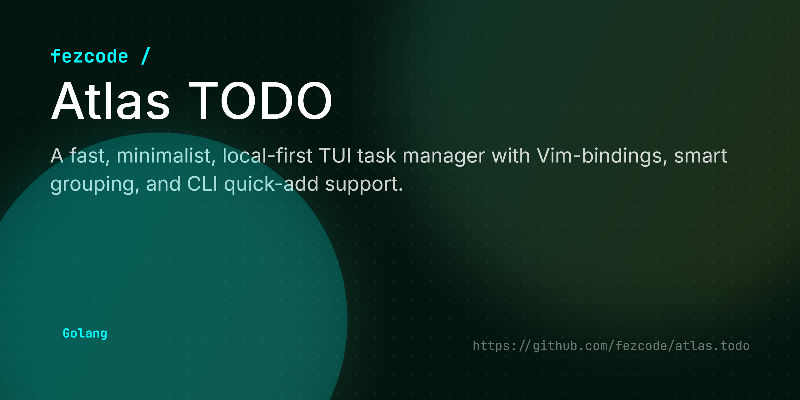

# Atlas Hash



**atlas.hash** is a fast, minimalist terminal utility for computing and comparing file hashes. Part of the **Atlas Suite**, it offers both a quick command-line output and an interactive TUI for easily verifying checksums (MD5, SHA1, SHA256, SHA512).


## ✨ Features

- ⚡ **Instant Computation:** Generates MD5, SHA1, SHA256, and SHA512 hashes simultaneously.
- 🖥️ **Interactive TUI:** Easily paste a target checksum to visually highlight and verify matches.
- 🐚 **CLI Mode:** Directly compute hashes and output to the terminal without launching the UI.
- 📦 **Cross-Platform:** Binaries available for Windows, Linux, and macOS.

## 🚀 Installation

### From Source
```bash
git clone https://github.com/fezcode/atlas.hash
cd atlas.hash
go build -o atlas.hash .
```

## ⌨️ Usage

### Interactive TUI Mode
Simply run the binary without arguments to enter the TUI:
```bash
./atlas.hash
```
The TUI will prompt you for a file path. Once entered, it computes the hashes. You can then paste a known hash (e.g., from a website) into the comparison field, and if it matches any of the computed hashes, it will be highlighted in green!

### CLI Non-Interactive Mode
To quickly compute the hashes and output them directly to your terminal, pass the file path as an argument:
```bash
./atlas.hash my_file.zip
```

Example Output:
```text
Target: my_file.zip

MD5        8d66de0b55a8e8b9c9d7a387a916c860
SHA1       557f7aaf9e38ada300611a75049acd73af8c444a
SHA256     99f1c097b0dc9ad7ad2a6d7148bada17fee2444c665d0714f0962aa65142568e
SHA512     383369d44940ae7bfa90396d0c4cf66d94be4fb535a520d97ddb9a89ca1da84694eaa54f685693c7e460143b11177f1946958f048a25f79ab96658f56b39f116
```

## 🕹️ Controls (TUI)

| Key | Action |
|-----|--------|
| `Type/Paste` | Enter file path or hash to compare |
| `Enter` | Confirm input |
| `Esc` | Quit the application |

## 🏗️ Building for all platforms

The project uses **gobake** to generate binaries for all platforms:

```bash
gobake build
```
Binaries will be placed in the `build/` directory.

## 📄 License
MIT License - see [LICENSE](LICENSE) for details.
